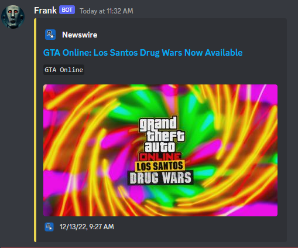

# rockstar-newswire
Rockstar's [newswire](https://www.rockstargames.com/newswire) feed to your discord server. Supports (Latest, GTA V, Red Dead 2 Redemption)

## Install
- Install the required Node packages via `npm i` or `yarn install`

## API

```js
    let newswire = require('./newswire');
    let latestNews = new newswire(type, webhookURL);
    // Available Types: rdr2, gtav, latest
    // Webhook URL: https://support.discordapp.com/hc/en-us/articles/228383668-Intro-to-Webhooks
    // News should automatically post and update every 2 hours.
```

## Tips
- You require discord [webhook URL](https://support.discordapp.com/hc/en-us/articles/228383668-Intro-to-Webhooks).
- Feed refreshes every 2 hours to make sure its up-to-date.
- It's recommened to take `newsdb.json` with you if you're porting the project to another host to prevent redundant news posts.

## Demo


## Credits
- Rockstar for their [newswire](https://www.rockstargames.com/newswire) JSON support
- [got](https://www.npmjs.com/package/got) for lightweight simple https requests.
